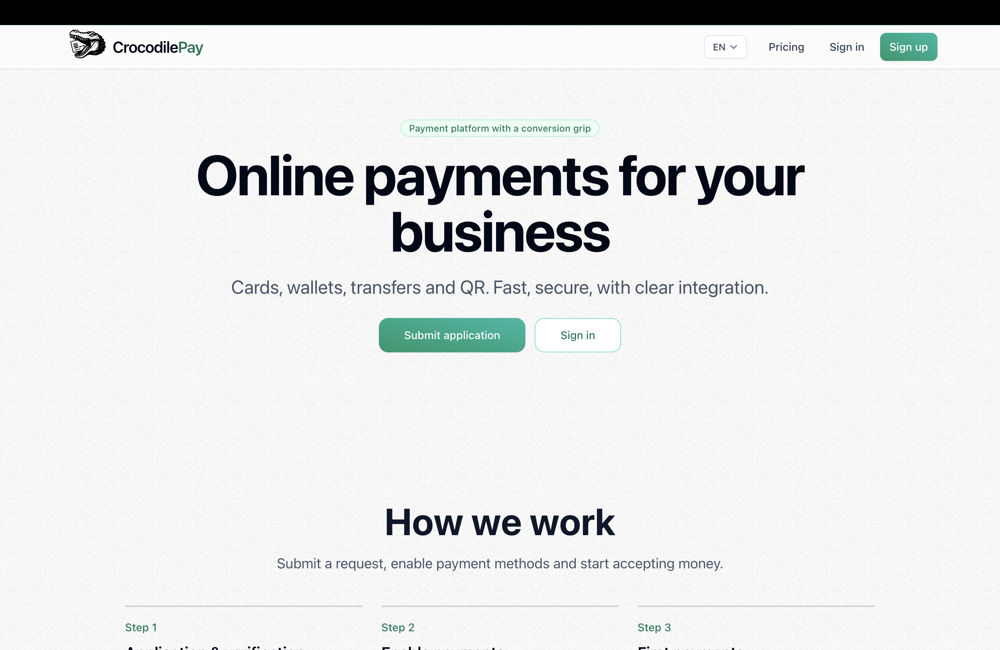
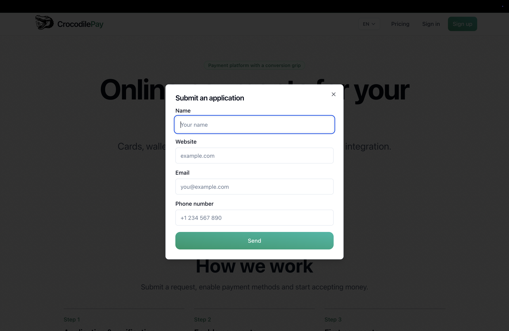
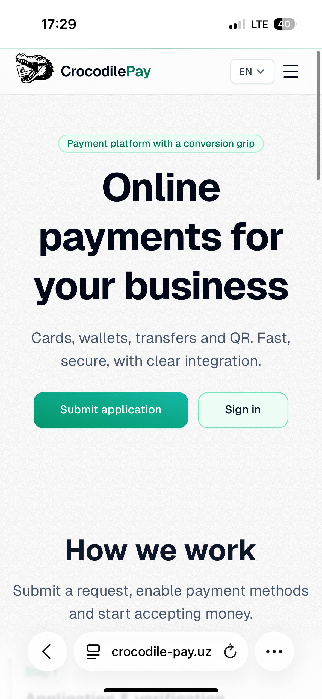

<div align="center">

# CrocodilePay Landing Page Template 

### A high-performance, responsive, and multilingual template, applications built with Next.js 14 (App Router).

### 🖼 Preview

| Hero section | Application form | Mobile |
|-------------|------------|-----------------|
|  |  |  |

**[🚀 Live Demo (View it here)](https://www.crocodile-pay.uz/en)**
> *(All screenshots are from the development build)*

</div>

## Built Using and Initialised with ⚒️
* **[Next.js 14 (App Router)](https://nextjs.org/)**
* **[Tailwind CSS](https://tailwindcss.com/)**
* **[Shadcn UI](https://ui.shadcn.com/)** Components + Themes
* Vercel's **[Geist Font](https://vercel.com/font)**
* Custom Components and Layouts (fully responsive for Mobile and Desktop)
* Atomic design pattern
* Multi-language **i18n** (eng, ru, uz)
* SEO optimization

## ➡️ Getting Started

First, install the dependencies and run the development server:

```bash
pnpm install
pnpn dev
```

Open [http://localhost:3000](http://localhost:3000) with your browser to see the result.

You can start editing the page by modifying `app/page.tsx`. The page auto-updates as you edit the file.
